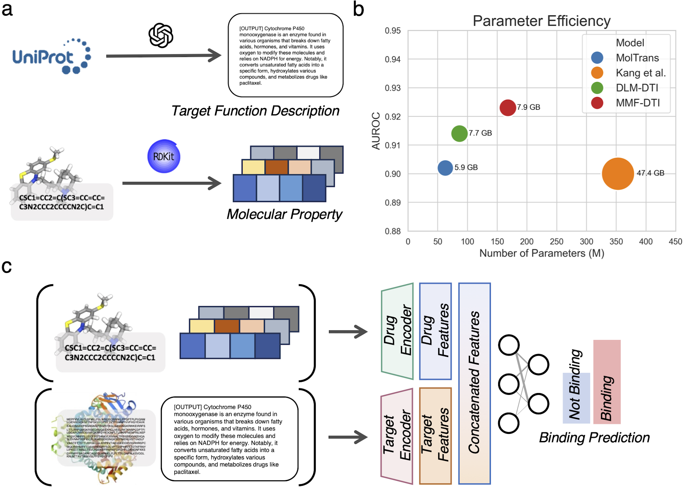
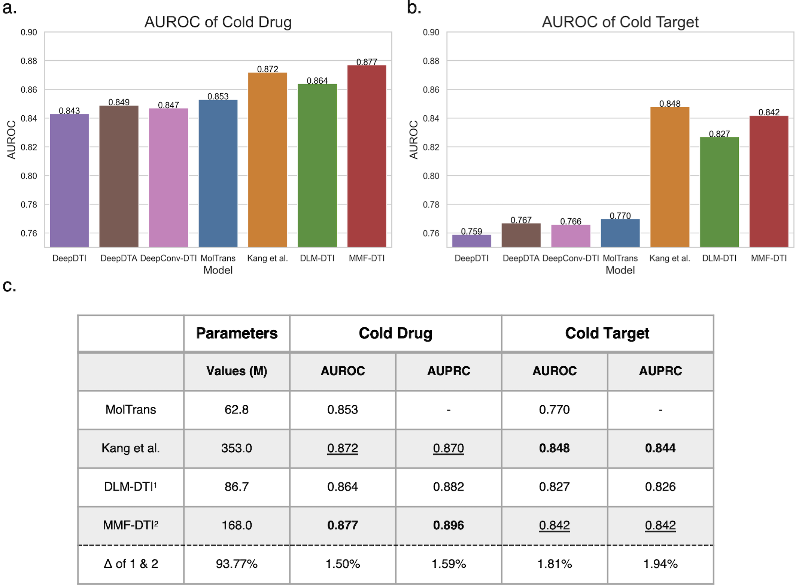

# MMF-DTI
Multi-Modal Fusion-based Efficient Model for Enhanced Generalization in Drug-Target Interaction Prediction



## Abstract
In the pursuit of accelerated and cost-effective drug discovery, accurately predicting Drug-Target Interactions (DTIs) remains a crucial challenge. Advanced computational approaches can significantly reduce the time and financial burden of traditional drug discovery methods. This study proposes MMF-DTI, a Multi- Modal Fusion-based model designed to enhance the generalization capabilities in DTI predictions. By integrating multi-modal data, including drug and target sequences, molecular properties, and target function descriptions, MMF-DTI demonstrates marked improvements in predicting interactions for both new drugs and targets. Our model incorporates a novel fusion strategy that combines features extracted from various data modalities through multi-modality encoders, including sequence encoders for SMILES and FASTA formats and additional encoders for molecular properties and target function descriptions. The efficacy of MMF-DTI is validated against benchmark datasets, showcasing its superior performance in generalization, particularly in cold-drug and cold-target scenarios. Furthermore, the model maintains efficient resource usage, enabling its operation even in constrained computational environments. MMF-DTI’s approach not only advances the field of DTI prediction but also underscores the potential of multimodal data fusion in enhancing model generalization, offering promising avenues for future drug discovery efforts.


## Performance-Original Settings

| Dataset   | Model        | AUROC             | AUPRC             |
| --------- | ------------ | ----------------- | ----------------- |
| BIOSNAP   | GNN-CPI      | 0.880 ± 0.007     | 0.891 ± 0.004     |
|           | DeepDTI      | 0.877 ± 0.005     | 0.877 ± 0.006     |
|           | DeepDTA      | 0.877 ± 0.005     | 0.884 ± 0.006     |
|           | DeepConv-DTI | 0.884 ± 0.002     | 0.890 ± 0.005     |
|           | MolTrans     | 0.896 ± 0.002     | 0.902 ± 0.004     |
|           | Kang et al.  | 0.914 ± 0.006     | 0.900 ± 0.007     |
|           | DLM-DTI      | 0.914 ± 0.003     | 0.914 ± 0.006     |
|           | MMF-DTI      | **0.921 ± 0.004** | **0.923 ± 0.005** |
| DAVIS     | GNN-CPI      | 0.841 ± 0.012     | 0.270 ± 0.020     |
|           | DeepDTI      | 0.862 ± 0.002     | 0.232 ± 0.006     |
|           | DeepDTA      | 0.881 ± 0.007     | 0.303 ± 0.044     |
|           | DeepConv-DTI | 0.885 ± 0.008     | 0.300 ± 0.039     |
|           | MolTrans     | 0.908 ± 0.002     | **0.405 ± 0.016** |
|           | Kang et al.  | **0.920 ± 0.002** | 0.395 ± 0.007     |
|           | DLM-DTI      | 0.895 ± 0.003     | 0.373 ± 0.017     |
|           | MMF-DTI      | 0.874 ± 0.007     | 0.333 ± 0.011     |
| BindingDB | GNN-CPI      | 0.888 ± 0.002     | 0.558 ± 0.015     |
|           | DeepDTI      | 0.909 ± 0.003     | 0.614 ± 0.015     |
|           | DeepDTA      | 0.901 ± 0.004     | 0.579 ± 0.015     |
|           | DeepConv-DTI | 0.845 ± 0.002     | 0.430 ± 0.005     |
|           | MolTrans     | 0.914 ± 0.003     | 0.623 ± 0.012     |
|           | Kang et al.  | **0.922 ± 0.001** | 0.623 ± 0.010     |
|           | DLM-DTI      | 0.912 ± 0.004     | **0.643 ± 0.006** |
|           | MMF-DTI      | 0.910 ± 0.002     | 0.625 ± 0.003     |


## Performance-New Drug and New Target Setttings




## Datasets

- Binary classification: DAVIS, Binding DB, and BIOSNAP

- Downloaded from [MolTrans](https://github.com/kexinhuang12345/MolTrans/tree/master/dataset)

- Preprocessed UniProt is avaiable at [HuggingFace space](https://huggingface.co/datasets/jonghyunlee/UniProt_functional text descriptions)

  

## Installation

- You can install the required libraries by running `pip install -r requirements.txt`
- If you encounter any installation errors, please don't hesitate to reach out to us for assistance.


## Example

- You can run experiments using config files (under config folder). For example you can launch an experiment by running `python run.py -c config/BIOSNAP_Labmda-True_Text-False_Prop-False_Missing-0_Unseen-No.yaml -s 42` or `python run.py --config config/BIOSNAP_Labmda-True_Text-False_Prop-False_Missing-0_Unseen-No.yaml --seed 42`
- Hyperparameters are recorded in config file, therefore, you can modify experiments easily.

### Example config file

```
dataset: 
    name: "BIOSNAP" # Options: DAVIS, BindingDB, BIOSNAP
    missing: 0 # Options: 70, 80, 90, 95 (Only for BIOSNAP)
    unseen: "drug" # Options: No, drug, target
    use_sampler: False # Options: True, False
    use_enumeration: False # Options: True, False
    
prot_length: 
    teacher: 545
    student: 545

lambda:
    learnable: True
    fixed_value: -1

prot_encoder:
    hidden_size: 1024
    num_hidden_layers: 2
    num_attention_heads: 16
    intermediate_size: 4096
    hidden_act: "gelu"

multimodality:
    use_text_feat: False # Options: True, False
    use_property: False # Options: True, False

training_config:
    batch_size: 32
    num_workers: 16
    epochs: 30
    hidden_dim: 1024
    learning_rate: 0.0001
    device: 0
    seed: -1
```